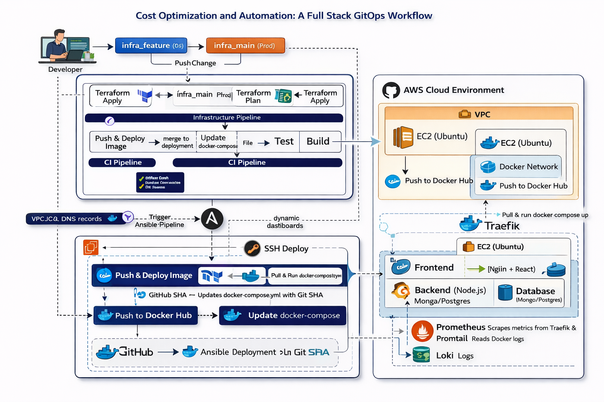

# cv-challenge-phase3
#  Automated CI/CD & Infrastructure as Code

**Automating the deployment of a 3-Tier Application and Monitoring Stack on AWS using Terraform, Ansible, and GitHub Actions.**




## 📖 Project Overview
This project focuses on building robust **CI/CD pipelines** to automate the lifecycle of both cloud infrastructure and application code. Moving beyond manual deployment, this phase introduces **GitOps** principles, automated cost estimation with **Infracost**, and a fully integrated **Monitoring Stack** (Prometheus, Grafana, Loki).

### 🏗️ Tech Stack
* **Cloud Provider:** AWS (EC2, VPC, Security Groups)
* **IaC:** Terraform
* **Configuration Management:** Ansible
* **CI/CD:** GitHub Actions
* **Containerization:** Docker & Docker Compose
* **Orchestration/Routing:** Traefik (Reverse Proxy)
* **Monitoring:** Prometheus, Grafana, Loki, Promtail, cAdvisor

---

## 🌲 Branching Strategy
We utilized a structured branching strategy to separate Infrastructure changes from Application code updates:

| Pipeline | Dev Branch | Production Branch | Trigger Action |
| :--- | :--- | :--- | :--- |
| **Infrastructure** | `infra_features` | `infra_main` | Merge (PR) triggers `terraform apply` |
| **Application** | `integration` | `deployment` | Merge triggers SSH Deployment |

---

## ⚙️ Pipelines Breakdown

### 1. Infrastructure Pipeline (`infra_features` → `infra_main`)
Manages the AWS resources and the Monitoring Stack.

* **Step 1: Validation:** Runs `terraform validate` on every push.
* **Step 2: Planning & Costing:** On PR creation, runs `terraform plan` and uses **Infracost** to comment the estimated monthly cost directly on the PR.
* **Step 3: Apply & Configure:**
    * Provisions AWS resources (EC2, Elastic IP, Security Groups).
    * **Ansible Trigger:** Automatically runs an Ansible playbook to install Docker and deploy the Monitoring Stack (Prometheus, Grafana, etc.).
    * *Key Fix:* Uses specific Ansible tags (`common,monitoring`) to ensure the `web_net` network exists before containers start.

### 2. Application Pipeline (`integration` → `deployment`)
Manages the build and deploy of the 3-tier web app (Frontend, Backend, DB).

* **Step 1: Continuous Integration (CI):**
    * Builds Docker images for Frontend and Backend.
    * Pushes images to Docker Hub with unique Git SHA tags.
    * **Automated Commit:** A "Robot" (GitHub Action) updates `docker-compose.yml` with the new image tags and commits it back to the repo.
* **Step 2: Continuous Deployment (CD):**
    * Deploys the updated `docker-compose.yml` to the EC2 instance via SSH.
    * Updates the running containers with zero downtime.

---

## 🛠️ Key Technical Challenges & Solutions

### The SPA Routing "404" Fix
**Problem:** The React frontend would throw a 404 error when reloading on a sub-route (e.g., `/login`) because Nginx tried to find a physical directory.
**Solution:** Baked a custom `nginx.conf` directly into the Docker image to handle Single Page Application (SPA) routing.
```dockerfile
# app/frontend/Dockerfile
COPY nginx.default.conf /etc/nginx/conf.d/default.conf
```

## 📊 Monitoring & Observability
Our stack ensures full visibility into both infrastructure health and application performance through a unified Traefik-managed entry point.

| Service | Access Path | Purpose |
| :--- | :--- | :--- |
| **Grafana** | `http://<IP>/grafana/` | Centralized data visualization and alerting. |
| **Prometheus** | `http://<IP>/prometheus/` | Time-series database for scraping system and app metrics. |
| **cAdvisor** | *Internal* | Real-time monitoring of container resource usage (CPU/RAM). |
| **Traefik** | `http://<IP>:8080/dashboard/` | Real-time traffic routing and service health overview. |
| **Loki/Promtail** | *Internal* | Log aggregation and indexing for all Docker containers. |

> **Note:** Prometheus and cAdvisor utilize Traefiks `StripPrefix` middleware to ensure correct internal path routing while maintaining clean external URLs.

---

## 🚀 How to Run & Execute

### Phase 1: Infrastructure Deployment
1.  **Work on Features:** Push changes to the `infra_features` branch to trigger `terraform validate`.
2.  **Verify Costs:** Open a Pull Request from `infra_features` to `infra_main`. Check the **Infracost** comment for estimated monthly cloud spend.
3.  **Provision:** Merge the PR to `infra_main`. This triggers `terraform apply` and the **Ansible** monitoring setup automatically.

### Phase 2: Application Deployment
1.  **Continuous Integration:** Push application code to the `integration` branch. The CI pipeline will:
    * Build and push Docker images to Docker Hub.
    * Automatically update `docker-compose.yml` with the unique Git SHA.
2.  **Continuous Deployment:** Merge `integration` into the `deployment` branch. The CD pipeline will SSH into your AWS instance and deploy the updated application stack.

---

## ✅ Acceptance Criteria Checklist
- [x] **Infrastructure Pipeline:** Automated Validation, Planning (with Infracost), and Apply.
- [x] **Ansible Integration:** Playbook triggered post-apply to set up the monitoring stack.
- [x] **Application CI:** Images built, tagged with Git SHA, and pushed to Docker Hub.
- [x] **Application CD:** Automatic deployment of the updated stack to AWS EC2.
- [x] **Health Check:** All services (Frontend, Backend, Monitoring) accessible via Port 80 with appropriate PathPrefixes.
- [x] **Documentation:** Detailed README and Architectural Diagram provided.

---

## 📝 Submission Deliverables
- [ ] **GitHub Repository Link:** [Your Repo Link Here]
- [ ] **Blog Post:** [Your Blog Link Here] (Includes architectural diagram and process documentation).
- [ ] **Screenshots:** Successfully executed pipelines (Terraform, Ansible, CI/CD).

---

**Built by AYOBAMI AGBOOLA** *Project completed as part of the CV Challenge - Week 3*